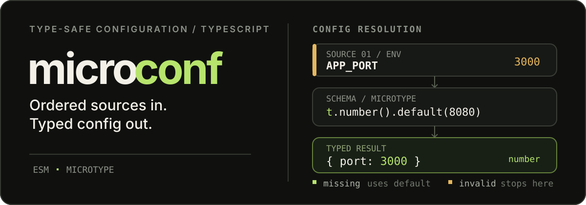

<div align="center">
  <h1>microconf</h1>
  <p>Lightweight and simple type-safety config library over <a href="https://github.com/Nirelc/microtype">microtype</a></p>
  
</div>

---

## Install

NPM

```bash
npm install @nirelc/microconf
```

Bun

```bash
bun install @nirelc/microconf
```

## Usage

```ts
import { defineConfig, t, env } from "@nirelc/microconf";

const config = defineConfig({
  schema: {
    port: t.number().min(0).max(65535).default(8080),
  },
  // optional. With no sources (or sources: []), use schema defaults only
  sources: [env()],
});
```

## Sources

For each field, sources are checked in array order:

- missing value allows the next source to run
- invalid value cause `ParseConfigError`, other sources and defaults can't replace it
- if every source is missing the value, the schema is parsed with `undefined` and `.default()` or `.optional()` are applied

Sources return `undefined` from `load(meta)` only for missing values. For existing values, return the schema's `ParseResult`, including validation failures. A successful result containing `data: undefined` is still a resolved value, not a missing one.

Available sources:

### `defaults()`

`defaults()` loads from schema `.default()` values

Defaults are always applied last by `defineConfig`, including with `sources: []`. You don't need to add `defaults()` explicitly

### `env()`

`env()` loads from env variables. We doesn't load `.env` files!

Schema keys are converted to env variable names by:

- add prefix if provided. e.g., with prefix `APP_`, `token` becomes `APP_TOKEN`
- camelCase -> camel_Case
- all chars -> UPPERCASE
- nested keys are converted to flat env variable names by delimiter (default: `__`)

e.g.:

```js
// index.ts
const config = defineConfig({
  schema: {
    nested: {
      key: t.string(),
    },
  },
  sources: [env()],
});

// .env
NESTED__KEY = hello;
```

this source can be configured with options:

```ts
env({
  prefix: "APP_", // optional, default: undefined
  delimiter: "__", // optional, default: "__"
  forceCoerce: true, // optional, default: true
});
```

`prefix` - prefix for env variable names. e.g., with prefix `APP_`, `token` becomes `APP_TOKEN`
`delimiter` - delimiter for nested keys. default: `__`
`forceCoerce` - boolean to force type coercion. default: `true`. e.g. if set to `false`, `t.boolean()` willn't coerce `"true"` to `true` and will return a parse error instead

## Errors

With `APP_PORT=abc`, `prefix: "APP_"` and a numeric `port` schema:

```text
Config parsing failed with 1 issue(s):
- APP_PORT from env: expected number
```

`ParseConfigError.issues` preserves the validation message and full field `path`, with `source` and the environment `key`. Missing required values are reported against the final `defaults` source.
